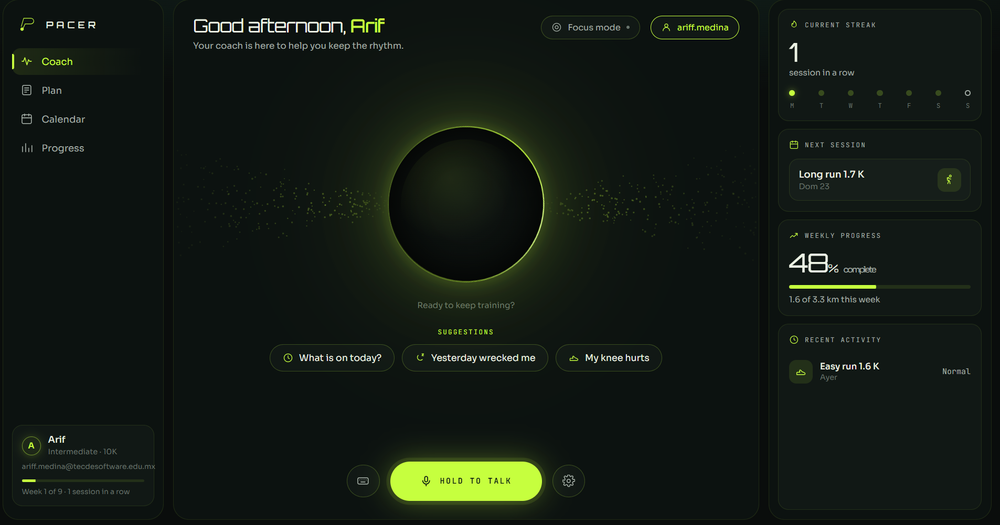
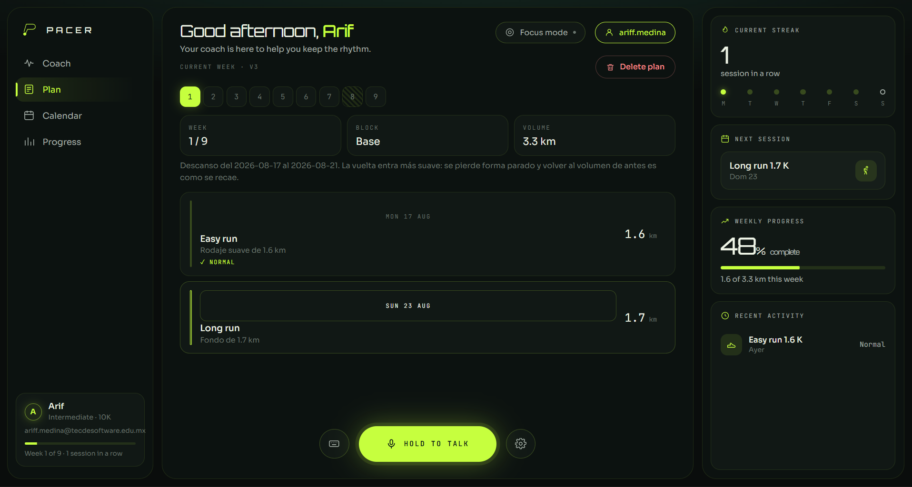
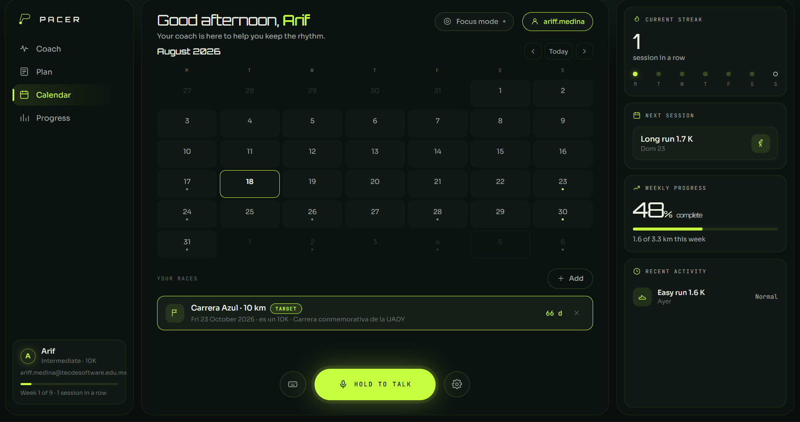
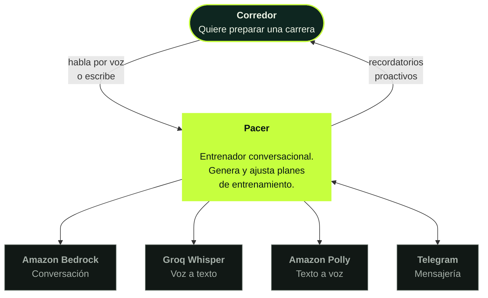
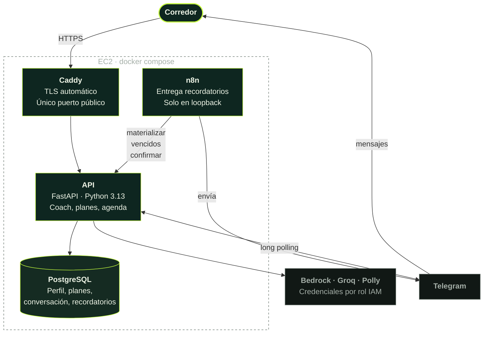
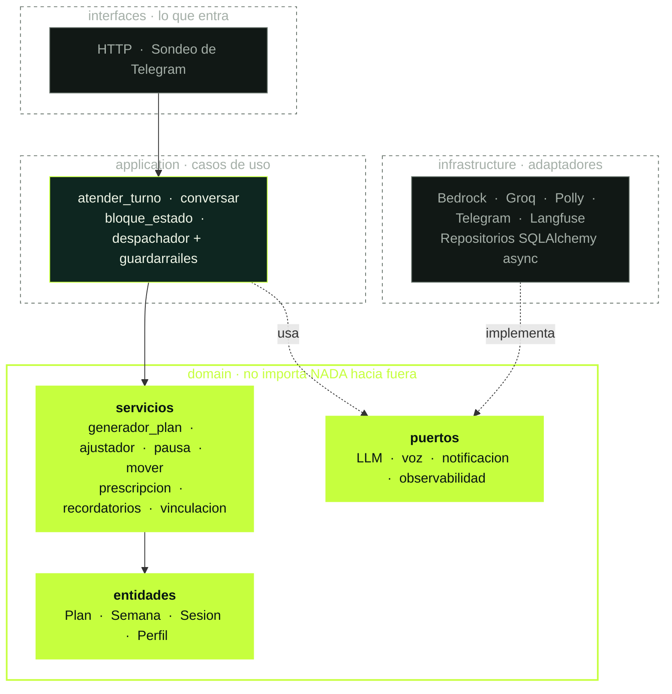
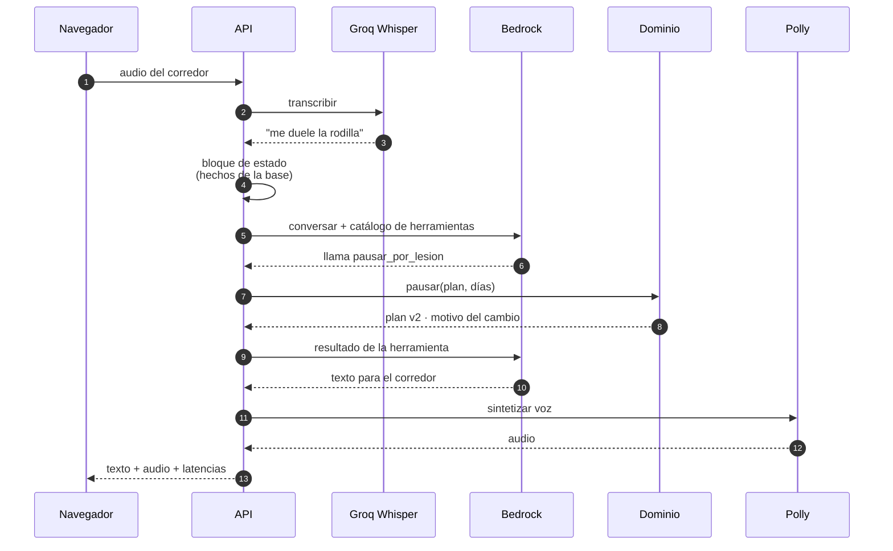
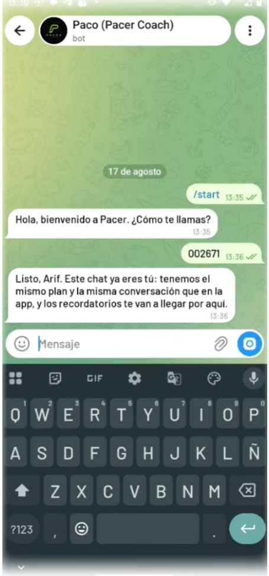
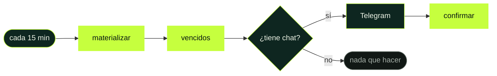

<div align="center">


**Un entrenador de running con el que se habla.**

Le cuentas qué carrera quieres correr, te hace cuatro preguntas y te arma un plan.
Después le dices que te duele la rodilla y el plan cambia de verdad — no en una
promesa, en la tabla.

<br>

[](https://pacer.100-60-57-94.sslip.io)
[](https://youtu.be/ve3VFUnMbyY)

<br>


</div>

<br>



<br>

> El micrófono exige HTTPS. Por eso el despliegue tiene certificado real de
> Let's Encrypt y no una IP pelada: sin TLS, la mitad del producto no existe.

---

## La idea, en una frase

> ### El modelo conversa. El código decide.

Un plan de entrenamiento es carga física sobre una persona. Un modelo que alucina
un 20% de más no comete un error de formato: manda a alguien a correr más de lo
que aguanta. Así que la carga la calcula una función pura, determinista y probada
por propiedades. El modelo traduce lo que dices, pide la acción y explica el
resultado en voz alta.

Nunca decide cuánto corres.

---

## Qué hace

| | |
|---|---|
| **Habla y escucha** | Voz a voz: Whisper transcribe, el coach responde, Polly lo dice. También por texto |
| **Arma el plan** | 5K, 10K, 21K y maratón, por nivel, días disponibles y fecha de carrera |
| **Se acuerda de ti** | Perfil, plan, carreras y conversación sobreviven al reinicio |
| **Reacciona de verdad** | Lesión, cambio de día o borrar un plan cambian la tabla, no solo la respuesta |
| **Agenda** | Calendario con tus carreras; el coach ve lo que apuntas y tú ves lo que él apunta |
| **Vive en dos canales** | Web y Telegram, unidos por un código de seis dígitos |
| **Te busca** | Recordatorios proactivos por Telegram, orquestados con n8n |
| **Habla dos idiomas** | Español e inglés, claro y oscuro, y funciona en un móvil de 360 px |

<table>
<tr>
<td width="50%"></td>
<td width="50%"></td>
</tr>
<tr>
<td align="center"><b>El plan</b><br>Semana a semana, con lo que toca cada día</td>
<td align="center"><b>La agenda</b><br>Tus carreras; el coach las ve y las edita</td>
</tr>
</table>

---

## Arquitectura

Tres niveles del modelo C4. Están dibujados con `flowchart` y no con la sintaxis
`C4Context` de Mermaid a propósito: esa última sigue siendo experimental y GitHub
la renderiza de forma inconsistente. Un diagrama que no se ve no documenta nada.

### Nivel 1 · Contexto

Quién usa el sistema y de qué depende.



### Nivel 2 · Contenedores

Qué piezas se despliegan y cómo hablan entre sí.



### Nivel 3 · Componentes de la API

La regla que sostiene todo: **las flechas solo apuntan hacia adentro.**



No es una buena intención escrita en un documento. Corre en CI:

```ini
[importlinter:contract:regla-de-dependencia]
type = forbidden
source_modules = pacer.domain
forbidden_modules = pacer.infrastructure, pacer.interfaces, pacer.application
```

Por eso el dominio se prueba sin red, sin base de datos y sin dobles.

### Un turno, de punta a punta



---

## Arrancarlo

Hace falta Docker y un `.env` — las variables están documentadas en
[`docs/variables-de-entorno.md`](docs/variables-de-entorno.md), listas para copiar.

```bash
docker compose -f infra/docker-compose.yml up --build
```

Eso levanta la app y Postgres en `http://localhost:8000`.

Las credenciales de AWS **no** van en el `.env`: se montan desde `~/.aws` en modo
lectura. En producción ni eso — las da el rol de instancia
([ADR-008](docs/adr/008-sin-llaves-en-disco.md)).

### Pruebas

```bash
pytest                          # 491 tests
ruff check pacer tests          # estilo
mypy pacer                      # tipos, 76 archivos
python -m importlinter.cli lint # el dominio no importa nada
```

---

## Decisiones

| ADR | Decisión |
|---|---|
| [001](docs/adr/001-arquitectura-hexagonal.md) | El dominio no importa nada, y CI lo verifica |
| [002](docs/adr/002-el-plan-no-lo-decide-el-modelo.md) | El plan lo calcula código, no el modelo |
| [003](docs/adr/003-un-solo-punto-de-composicion.md) | Cambiar de modelo es cambiar una constante |
| [004](docs/adr/004-versionar-en-vez-de-mutar.md) | Los planes se versionan, no se editan |
| [005](docs/adr/005-hechos-en-tablas-conversacion-efimera.md) | Hechos en tablas; la conversación es efímera |
| [006](docs/adr/006-n8n-orquesta-nunca-decide.md) | n8n entrega; la app decide |
| [007](docs/adr/007-identidad-por-canal-cuenta-opcional.md) | Identidad por canal, cuenta opcional |
| [008](docs/adr/008-sin-llaves-en-disco.md) | Ninguna llave de AWS vive en el proyecto |

---

## La ley del proyecto

Escrita después de perseguir el mismo fallo cuatro veces:

> **Lo que no le das explícito al modelo, lo inventa.**
> **Lo que quiere hacer y no puede, lo falsea.**

Las dos mitades tienen remedios distintos, y confundirlos cuesta días:

- **Lo que inventa** se arregla con **datos**: al bloque de estado, deletreados.
  El coach dijo estar en 2024 porque nadie le había dado la fecha. Hoy recibe
  `FECHA DE HOY: lunes 17 de agosto de 2026 (2026-08-17)`.
- **Lo que falsea** se arregla con **herramientas**: el coach prometió pausar el
  entrenamiento por una lesión y no lo hizo, porque no existía forma de hacerlo.
  No dijo "no puedo" — inventó un plan nuevo plausible. Se arregló creando
  `pausar_por_lesion` y una regla de no prometer.

---

## Multiusuario

Tres identidades en capas, para que compartir el enlace no sea compartir la
cuenta ([ADR-007](docs/adr/007-identidad-por-canal-cuenta-opcional.md)):

1. **Cookie anónima** — cada navegador es su propio corredor desde la primera
   visita. Sin registro, sin fricción.
2. **Cuenta opcional** — correo y `scrypt`. Registrarse *adopta* el corredor que
   ya venías usando: nadie pierde su plan por crear la cuenta.
3. **Telegram** — ajustes → Telegram → *Generar código*. Le mandas los seis
   dígitos a [@Pacer_Coaching_Bot](https://t.me/Pacer_Coaching_Bot) y ese chat
   pasa a ser tú: mismo plan, misma conversación, y empiezan a llegarte los
   recordatorios.

<div align="center">

<br><i>El canje del código: a partir de aquí, los dos canales son la misma persona</i>
</div>

---

## Recordatorios

La app decide qué recordar y cuándo; n8n solo transporta
([ADR-006](docs/adr/006-n8n-orquesta-nunca-decide.md)):



`vencidos` devuelve cada recordatorio con **su propio `chat_id`**, así que el
mismo workflow sirve para un corredor o para mil. `clave` es UNIQUE en la base:
materializar dos veces no duplica y confirmar dos veces no reenvía — los
reintentos son seguros por construcción del esquema, no por el cuidado de quien
llama.

El workflow está en [`n8n/workflows/recordatorios.json`](n8n/workflows/recordatorios.json).
Puede vivir en el repositorio porque los secretos están en las credenciales de
n8n, nunca en el JSON.

---

## Despliegue

EC2 + `docker compose` + Caddy para TLS automático.

```bash
docker compose --env-file ../.env \
  -f docker-compose.yml -f docker-compose.prod.yml up -d --build
```

Tres diferencias con desarrollo, y las tres son de seguridad:

- El montaje de `~/.aws` **desaparece**: las credenciales las da el rol de
  instancia por IMDS. Verificado en la máquina: `/home/pacer/.aws` no existe.
- **Solo Caddy publica puertos.** Postgres, la app y n8n viven en la red interna;
  n8n escucha únicamente en loopback y se administra por túnel SSH.
- La contraseña de Postgres deja de ser la de ejemplo.

---

## Qué está construido y qué está diseñado

Un take-home de fin de semana tiene límites, y prefiero decirlos yo.

**Construido y verificado en producción**

Voz completa · plan determinista de 3 a 6 días con 491 tests · memoria entre
sesiones y entre canales · agenda de carreras · pausa por lesión, mover sesión,
borrar plan · multiusuario con cuenta opcional · vinculación web ⇄ Telegram ·
recordatorios entregados de punta a punta · despliegue con HTTPS · migración
aditiva que no pierde datos.

**Diseñado, no construido**

- **Alembic.** La migración aditiva actual agrega columnas e índices nuevos y no
  toca nada más. Suficiente para un entorno; insuficiente en cuanto haya dos.
- **Recuperación del audio.** Si Polly falla, el turno se entrega en texto. No hay
  reintento con voz alternativa.
- **Límite de uso.** No hay cuota por corredor. En una demo pública sobra; en
  producción es lo primero que haría falta.
- **Métricas.** Langfuse traza cada turno; no hay panel de latencia agregada.

---

## Cómo se eligió cada pieza

| Pieza | Por qué |
|---|---|
| **Bedrock** (Claude Haiku 4.5) | Medido contra Nova Lite con el mismo prompt: Nova no llamó la herramienta y filtró un bloque `<thinking>` que el TTS habría leído en voz alta |
| **Groq Whisper** | Transcripción en cientos de milisegundos. En una conversación hablada, la latencia *es* la experiencia |
| **Polly** `generative`, voz Mia | Único motor con es-MX que no suena a robot. Vive en `us-east-1` porque en `us-east-2` solo hay `standard` |
| **n8n** | El brief lo valoraba, y encaja: orquesta y entrega sin decidir nada |
| **Postgres** | El esquema es relacional de verdad: plan → semana → sesión, con versiones |
| **Caddy** | Certificado automático en una línea. Sin TLS no hay micrófono |

---

## Lo que salió mal

Los fallos que más enseñaron, por si sirven de algo:

- **El coach prometía y no cumplía.** Dijo que pausaba el entrenamiento por una
  lesión y el plan no cambió. No existía la herramienta, así que improvisó una
  respuesta plausible. Lo que un modelo quiere hacer y no puede, lo falsea.
- **Compartir el enlace era compartir la cuenta.** Toda visita resolvía al primer
  corredor de la tabla.
- **`ALTER TABLE ADD COLUMN` no crea los índices.** `clave_sesion` llegó a
  producción sin su UNIQUE y dos peticiones simultáneas creaban dos corredores
  con la misma cookie.
- **El servidor vivía en UTC.** Desde las 18:00 en México la app creía que ya era
  mañana y el coach anunciaba la sesión equivocada.
- **SQLite devuelve fechas sin zona aunque la columna la declare.** El mismo
  código funcionaba en Postgres y reventaba en las pruebas.
- **Redondear cada sesión desviaba el volumen semanal.** Con seis sesiones el
  ruido acumulado se leía como una subida del 12.7% donde la progresión pedida
  era del 10%. Lo destapó extender el plan a cinco y seis días.
- **Un usuario real dijo "5 días" y la app devolvió un 500.** El generador solo
  componía 3 o 4 y el error subía sin que nadie lo atrapara. Un límite del
  sistema se explica; no se estrella.

Cada uno tiene su test. Ninguno vuelve.

<div align="center">
<br>
<sub>Prueba técnica · <b>Ariff Medina</b> · agosto 2026</sub>
</div>
